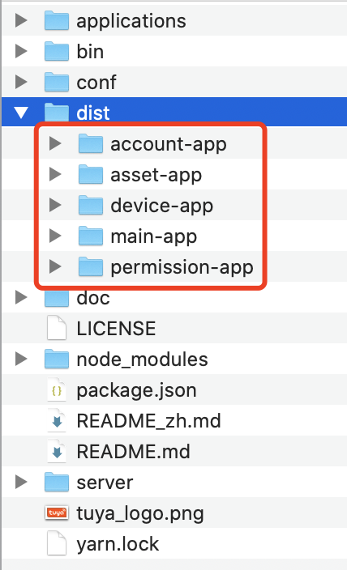

# 开始

## 前言
本仓库提供的管理控制台是基于 `Tuya IoT Cloud` ，如无二次开发定制需求，可通过 `Docker` 镜像做本地私有化部署，[Docker 镜像地址](https://hub.docker.com/r/iotportal/iot-suite)

## 简介

## 前置准备

### Windows 用户
下载安装 `Nodejs` [官网地址](https://nodejs.org/en/)

下载安装 `Nginx` [官网地址](http://nginx.org/en/download.html)

----

### Mac 或者 Linux 用户

#### Nodejs
如宿主机已安装 `Nodejs`，请确保版本不低于 v12

启动命令行工具 `Terminal`

使用如下命令查看当前的 `Nodejs` 版本

```
node -v
```
如已满足 `Nodejs` 环境要求，请忽略如下 `Nodejs` 安装步骤

1. 安装 `nvm`
```
curl -o- https://raw.githubusercontent.com/nvm-sh/nvm/v0.35.3/install.sh | bash
```
2. 安装 `Nodejs`
```
nvm install v14.17.1
```
3. 安装 `yarn`
```
npm install -g yarn
```
4. 如果是中国大陆用户，请更换 `yarn` 默认仓库地址，其他地区用户请忽略
```
yarn config set registry https://registry.npm.taobao.org/
```
5. 检查 `Nodejs` 是否安装成功
```
node -v
```
查看当前 node 版本情况，如能正确输出 v14.17.1, 则表示安装成功

#### Nginx
启动命令行工具`Terminal`
如已安装 `Nginx` 请忽略此步

1. 安装 `xcode-select`
```
xcode-select --install
```
> 注意：如果执行命令报 安装失败不能安装该软件 因为当前无法从软件更新服务器获得，请移步[Apple Developer](https://developer.apple.com/download/more/) 先登录。下载对应版本的Command Line Tools

2. 安装 `homebrew`
```
/bin/bash -c "$(curl -fsSL https://raw.githubusercontent.com/Homebrew/install/master/install.sh)"
```
具体可查看 [homebrew](https://brew.sh/)
> 小技巧: 为了节省时间，执行 brew install 命令后，可以按下 ctrl-c 组合键跳过 brew update 步骤

3. 安装 `Nginx`
```
brew install nginx
```

4. 检查 `Nginx` 是否安装成功
```
nginx -v
```
查看 `Nginx` 版本


----


## 启动

#### 创建服务运行目录
Mac or Linux
```
mkdir -p /www/iot-portal
cd /www/iot-portal
```

Windows 用户

找到一个工作目录，然后创建文件夹 `iot-portal`

----

#### 下载代码
1. 通过git clone下载代码

打开命令行工具，在 /www/iot-portal 目录执行如下命令
```
git clone https://github.com/tuya/iot-portal.git
```
2. 直接下载压缩包

下载完成后，将解压后的代码复制到 /www/iot-portal
```
https://github.com/tuya/iot-portal/archive/refs/heads/master.zip
```
完成此步会得到如下结果


-----

#### 安装项目依赖

微前端的架构，每个应用均需要独立编译

提供两种方式来安装依赖和编译，大家可以根据喜好来

#### 1. 通过预制命令安装依赖和编译

<details>

##### 1.1 安装依赖

打开命令行工具

跳转到项目根目录
```
cd /www/iot-portal
```
安装依赖
```
yarn
```
依赖安装完成后会得到如下结果

##### 1.2 命令集
首次使用，一键安装依赖并编译输出
```
npm run apps:install && npm run build
```
> 由于应用较多，此步操作耗时会比较长，请耐心等待

如已安装好依赖，请直接编译输出
```
npm run build
```

----

###### 预制如下命令集

安装全部应用的依赖
```
npm run apps:install
```
编译所有应用
```
npm run apps:build
```
同步所有结果集到工作目录
```
npm run sync
```
编译并同步结果集
```
npm run build
```


</details>

#### 2. 手动安装依赖和编译

<details>
下面以主应用举例，安装依赖和编译流程

打开命令行工具

跳转到主应用目录
```
cd /www/iot-portal/main-app
```
安装依赖
```
yarn
```
依赖安装完成后会得到如下结果


开始编译项目
```
yarn run build
```
编译完成后，会得到如下结果


重复上述步骤，将剩余子应用项目的依赖安装好，并编译完成

> Windows 用户的命令行工具，请查阅[微软官方文档](https://docs.microsoft.com/en-us/windows/terminal/get-started)


具体项目运行命令集
```
// 编译构建源码，输出生产环境代码
1. npm run build 

// 启动本地调试环境
2. npm run start
```
</details>

