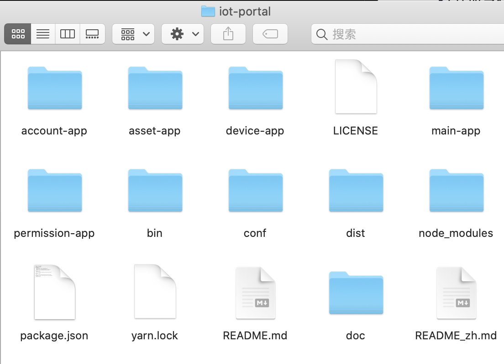
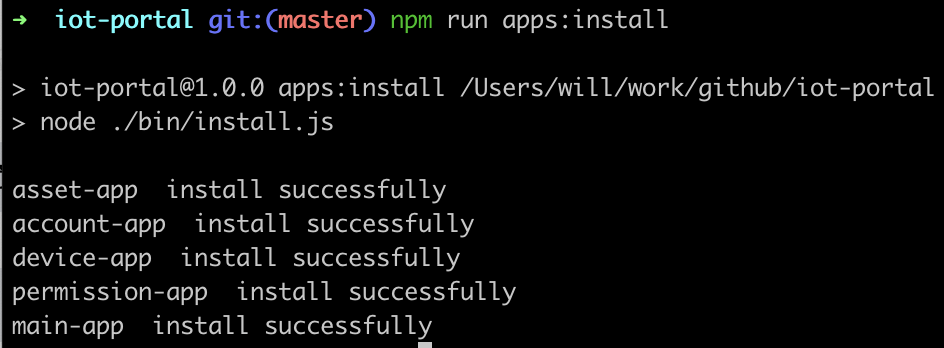
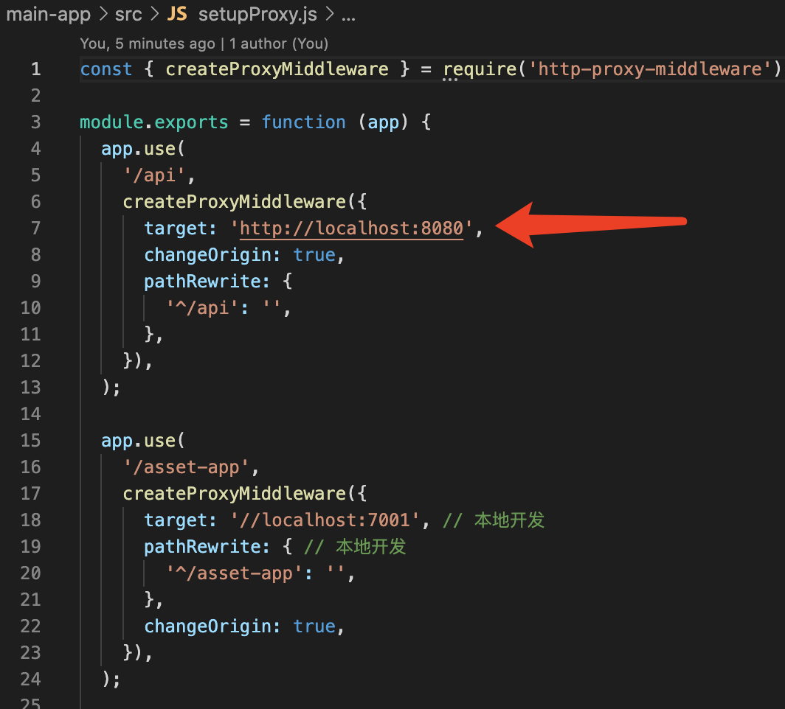
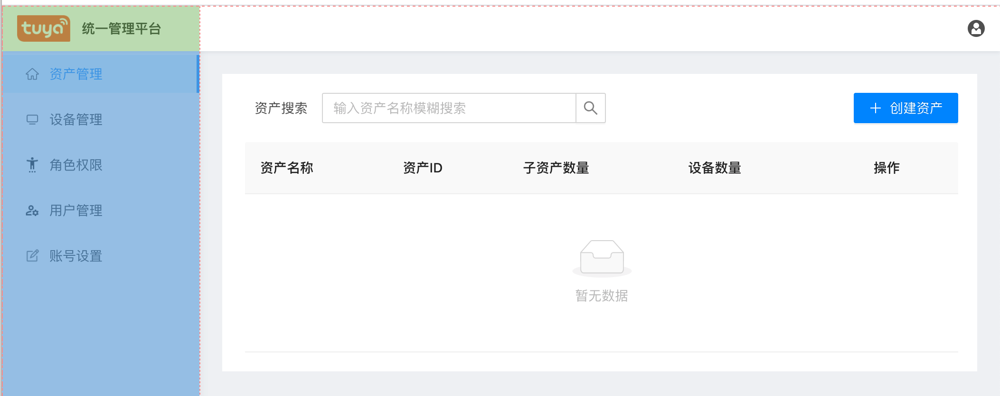
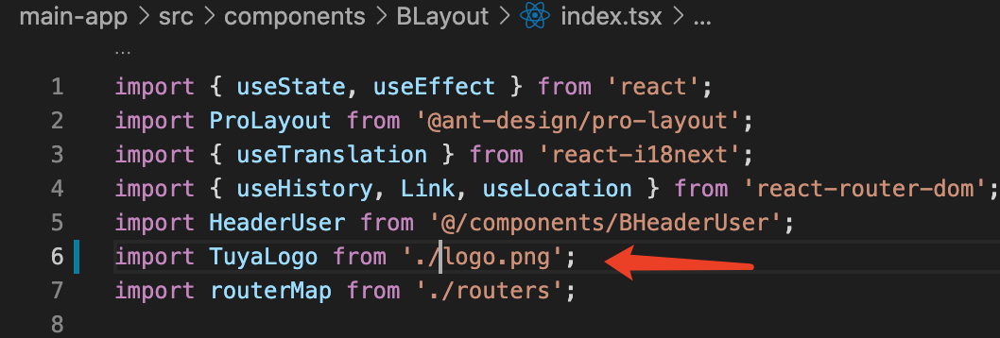

# 快速开始

## 前置说明

本项目依赖 `qiankun` 框架提供的微前端能力，如有其他部署需求，请移步 `qiankun` 官网查看 [qiankun部署说明](https://qiankun.umijs.org/zh/cookbook#%E5%A6%82%E4%BD%95%E9%83%A8%E7%BD%B2)

## 安装依赖

### Windows 用户
下载安装 `Nodejs` [官网地址](https://nodejs.org/en/)

### Mac 或者 Linux 用户

#### Nodejs

<details>

如宿主机已安装 `Nodejs`，请确保版本不低于 v12

启动命令行工具 `Terminal`

使用如下命令查看当前的 `Nodejs` 版本

```
node -v
```
如已满足 `Nodejs` 环境要求，请忽略如下 `Nodejs` 安装步骤

1. 安装 `nvm`
```
curl -o- https://raw.githubusercontent.com/nvm-sh/nvm/v0.35.3/install.sh | bash
```
2. 安装 `Nodejs`
```
nvm install v14.17.1
```
3. 安装 `yarn`
```
npm install -g yarn
```
4. 如果是中国大陆用户，请更换 `yarn` 默认仓库地址，其他地区用户请忽略
```
yarn config set registry https://registry.npm.taobao.org/
```
5. 检查 `Nodejs` 是否安装成功
```
node -v
```
查看当前 node 版本情况，如能正确输出 v14.17.1, 则表示安装成功


</details>

## 安装项目以及依赖

### 创建服务运行目录
Mac or Linux
```
mkdir -p /www/iot-portal
cd /www/iot-portal
```

Windows 用户

找到一个工作目录，然后创建文件夹 `iot-portal`

----

### 下载代码

通过如下两种方式下载代码，任选一种即可

1. 通过git clone下载代码

打开命令行工具，在 /www/iot-portal 目录执行如下命令
```
git clone https://github.com/tuya/iot-portal.git
```
2. 直接下载压缩包

下载完成后，将解压后的代码复制到 /www/iot-portal
```
https://github.com/tuya/iot-portal/archive/refs/heads/master.zip
```
完成此步会得到如下结果



-----

#### 安装项目依赖

微前端的架构，每个应用均为独立项目，有自己的独立依赖

提供两种方式来安装依赖，大家可以根据喜好来

#### 1. 通过预制命令安装依赖和编译

<details>

##### 1.1 安装依赖

打开命令行工具

跳转到项目根目录
```
cd /www/iot-portal
```
安装依赖
```
yarn
```
依赖安装完成后会得到如下结果

##### 1.2 命令集
首次使用，一键安装依赖并编译输出
```
npm run apps:install
```
> 由于应用较多，此步操作耗时会比较长，请耐心等待



----

###### 预制如下命令集

安装全部应用的依赖
```
npm run apps:install
```
编译所有应用
```
npm run apps:build
```
同步所有结果集到工作目录
```
npm run sync
```
编译并同步结果集
```
npm run build
```


</details>

#### 2. 手动安装依赖和编译

<details>
下面以主应用举例，安装依赖和编译流程

打开命令行工具

跳转到主应用目录
```
cd /www/iot-portal/main-app
```
安装依赖
```
yarn
```
依赖安装完成后会得到如下结果


重复上述步骤，将剩余子应用项目的依赖安装好，并编译完成

> Windows 用户的命令行工具，请查阅[微软官方文档](https://docs.microsoft.com/en-us/windows/terminal/get-started)


具体项目运行命令集
```
// 编译构建源码，输出生产环境代码
1. npm run build 

// 启动本地调试环境
2. npm run start
```
</details>

### 启动本地调试环境

微前端分为主应用和子应用，启动配置稍有差异，下面分别启动主应用和子应用

在启动主应用之前，请确保后端服务已启动，配套后端项目请访问xxxxxx

前端项目中默认请求的后端地址为 http://localhost:8080

如需变更请求地址，请修改 ./main-app/src/setupProxy.js 第7行 api转发地址



#### 启动主应用

在命令行中，跳到主应用目录
```
cd /www/iot-portal/main-app
```

启动项目
```
npm run start
```

#### 启动子项目

使用资产管理应用为例
另启新命令行窗口

```
cd /www/iot-portal/asset-app
npm run start
```

完成如上两步，在浏览器中打开 [http://localhost:3000](http://localhost:3000) 即可访问项目


### 二次开发示例

更换logo

页面整体采用左右布局，左侧为导航栏，右侧为具体业务内容

顶部采用fixed固定布局



布局组件在主应用中，文件位置为 main-app/src/components/BLayout/index.tsx

tuyalogo.png 文件与布局组件在同一目录，main-app/src/components/BLayout

找到一个合适的图片，放到 main-app/src/components/BLayout，并将其命名为logo.png 

修改 main-app/src/components/BLayout/index.tsx 第6行
```
import TuyaLogo from './logo.png';
```



保存文件

之前启动的主应用DevServer会自动重新编译，稍等片刻，热更新会自动替换页面logo
