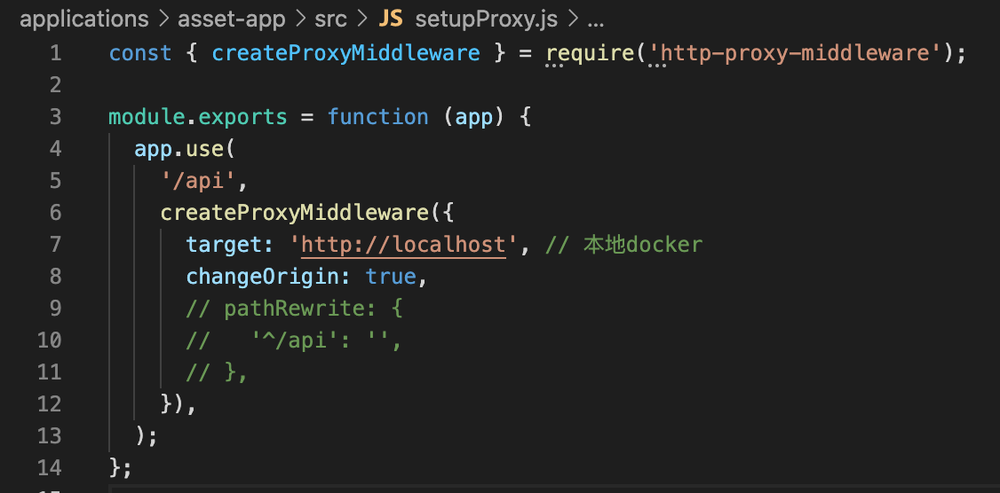
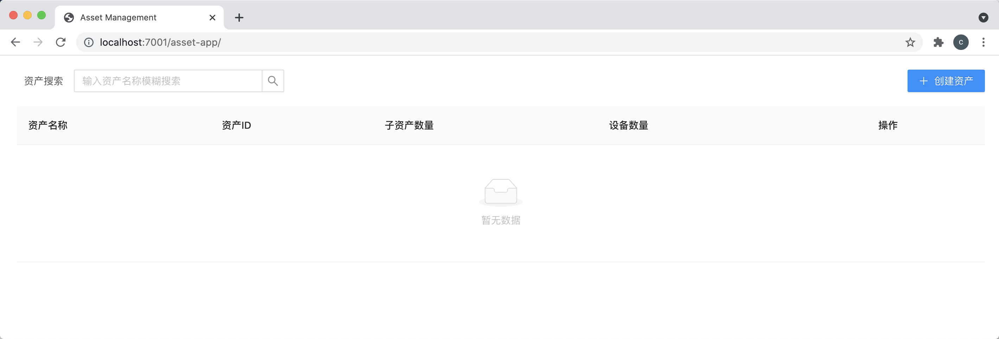
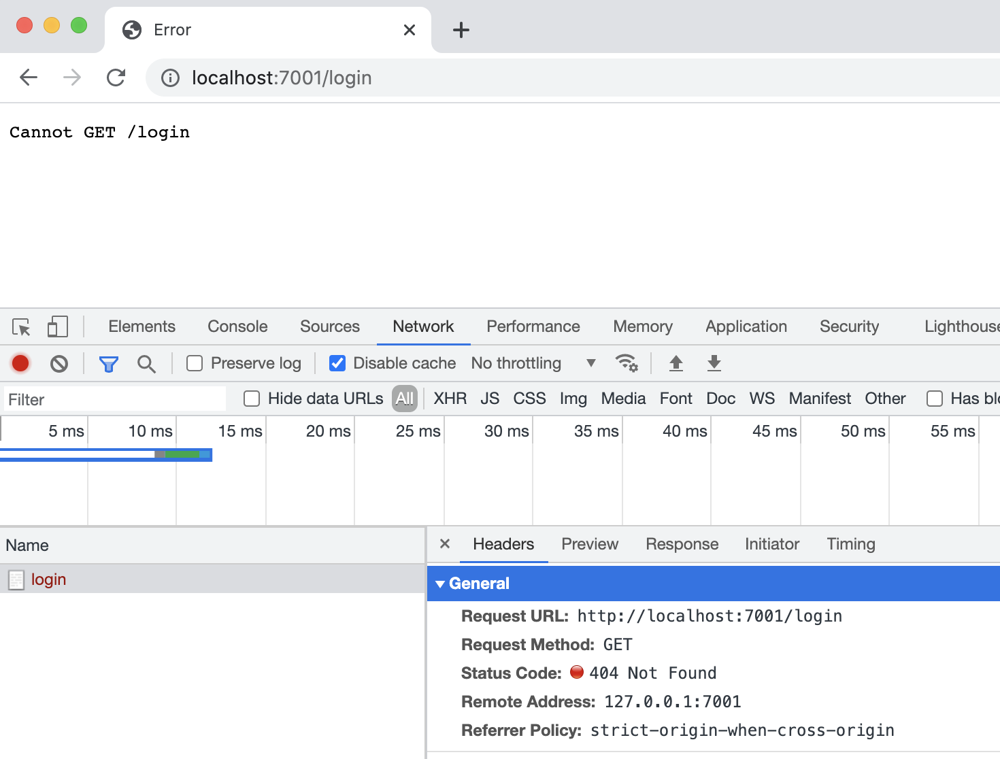
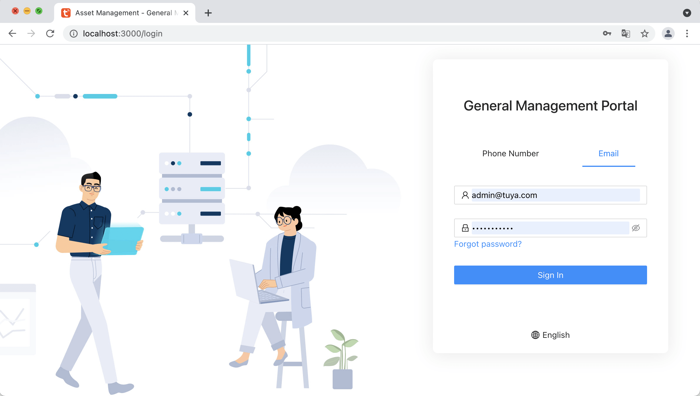
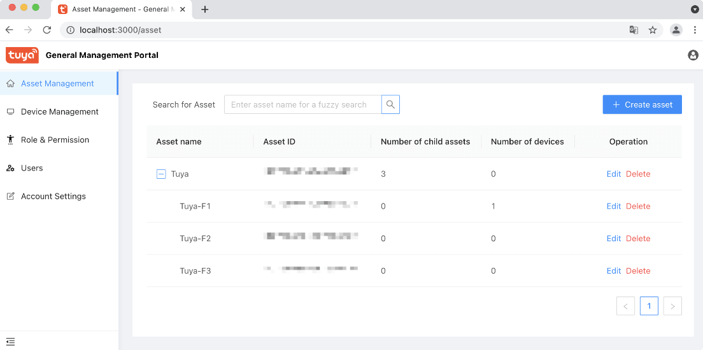

## 调试服务

SaaS开发框架采用的是微前端的架构，每个微前端应用均为独立项目，需要配置独立的依赖，且每个微前端应用均可独立部署独立运行。本文以调试账户管理 `asset-app` 为例为您介绍调试流程。


### 步骤一：启动后端服务&检查代理配置

为了简化调试难度，我们使用Docker镜像启动后端服务，具体的Docker服务运行步骤请参考此[文档](https://developer.tuya.com/cn/docs/iot/SaaSDevelopmentFramework_Image?id=Kapsg7pttb8f2)

在这里我们指定Docker启动端口为`80`

检查 `{project}/applications/asset-app/src/setupProxy.js`，
确保后端代理接口配置 `http://localhost` 正确并启动，确保要调试的微应用的端口配置正确。




### 步骤二：启动子应用
启动asset-app微应用

```bash
cd path/to/asset-app # 进入需要调试的子应用
npm install # 安装依赖，依赖安装只需执行一次
npm run start # 启动调试服务
```
> 服务启动后，在浏览器中打开服务运行地址 `http://localhost:7001/asset-app/`
此处的7001端口，可以在 `{project}/applications/asset-app/.env` 中修改
我们使用子目录的形式部署子应用，所以这里会有`/asset-app/`目录存在

1. 在后端服务还没有启动的情况下
完成编译流程后，我可以在浏览器中看到如下界面


2. 在一切正常的情况下
完成编译流程后，会自动跳到`http://localhost:7001/login`
这是因为我们的项目中还没有登录态请求头，后端服务收到请求后会抛异常出来
前端服务在收到异常后，发现是登录态失效，跳转到/login，需要用户重新登陆


但我们的子应用不提供登陆功能，这时，我们将视角转回到主应用


### 步骤三：启动主应用

维持刚刚的子应用命令行窗口不动，启动一个新的命令行窗口

启动主应用与启动子应用类似


```bash
cd path/to/main-app # 进入主应用
npm install #安装依赖，只需执行一次
npm run start # 启动调试服务
```
启动完成，默认会来到登陆页面
Docker服务默认初始化的账户是
账号：admin@tuya.com
密码：Test123456

如下图所示



登陆成功后就可以进入到asset-app


至此，我们完成了主应用+子应用的嵌套调试服务的启动


## 便捷指令说明

除开各个项目的运行命令
为了方便管理整个项目中的各个子应用
我们提供一些便捷的指令，来构建完整的应用。

```bash
cd path/to/iot-portal  # 回到根目录
npm install # 安装必要的依赖工具
npm run apps:install # 依次为所有子应用安装依赖
npm run apps:build # 依次构建所有子应用
npm run sync # 所有构建文件都拷贝到到 /dist
docker build -f conf/Dockerfile . -t iot-portal-fe # 构建 Docker镜象， 可选

```

构建后的文件如下：
